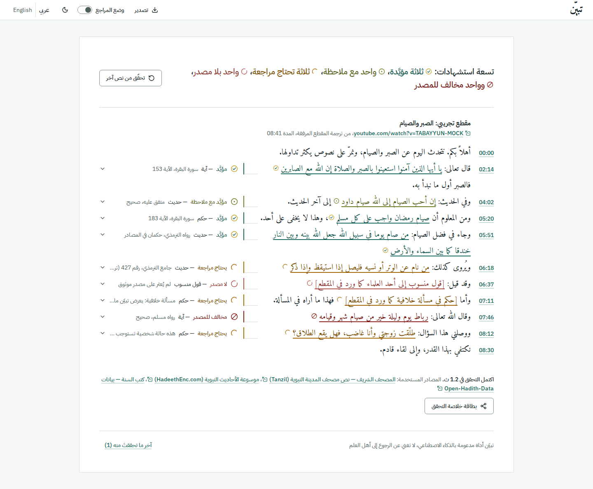
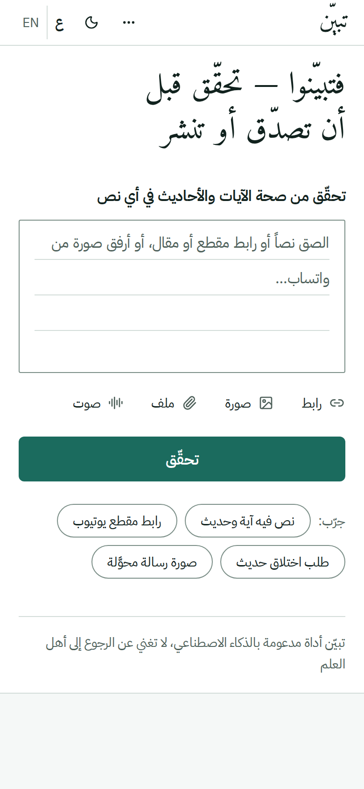
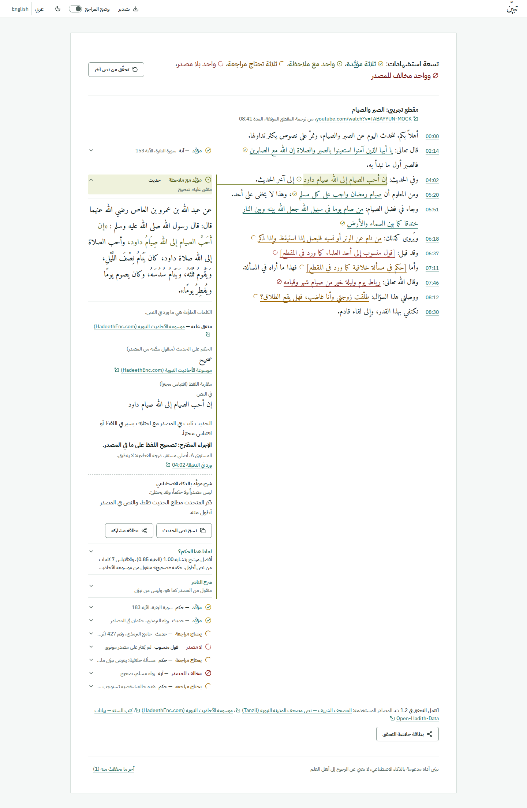
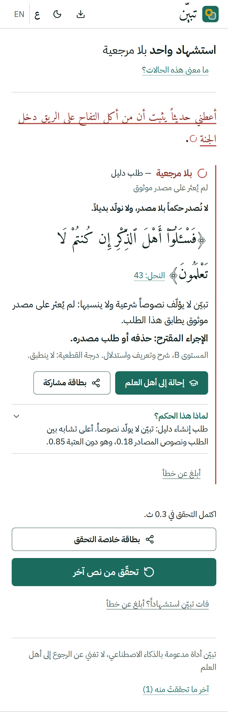
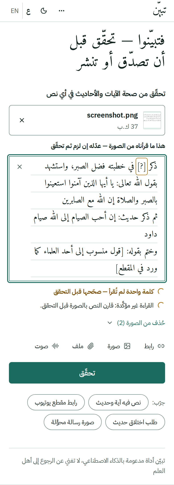
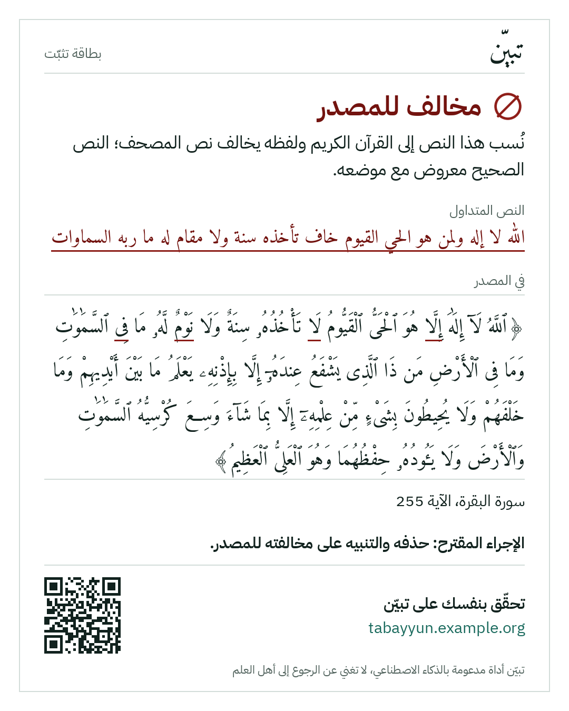
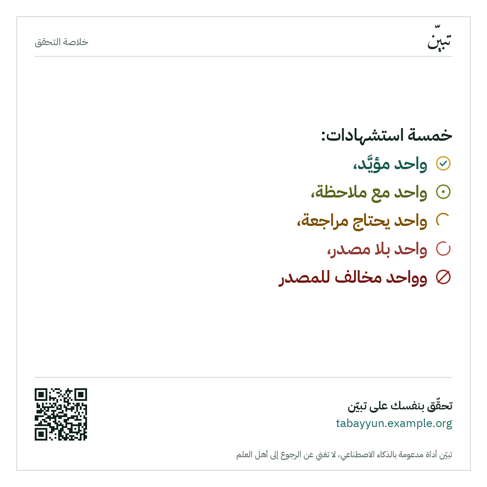
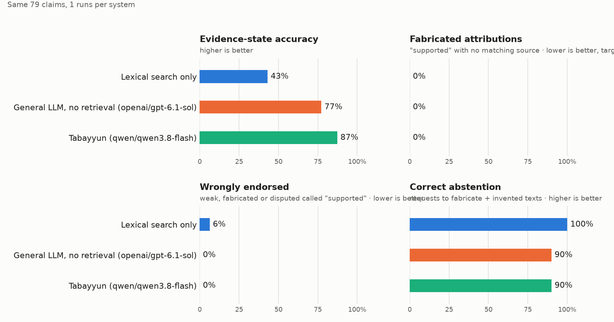

<div dir="rtl">

# تبيّن — تحقّق قبل أن تصدّق أو تنشر

**تبيّن** أداة مدعومة بالذكاء الاصطناعي تتحقق من صحة النصوص الشرعية ونسبتها داخل أي محتوى: الصق
نصاً أو رابط مقال أو رابط مقطع أو ارفع ملفاً صوتياً، فتستخرج كل استشهاد فيه (آية، حديث، حكم، قول
منسوب)، وتطابقه مع المصادر المعتمدة، وتعرض **حالة دليله بإسناد كامل** — وتمتنع صراحةً عندما لا
تجد مصدراً.

> تبيّن أداة مدعومة بالذكاء الاصطناعي، لا تغني عن الرجوع إلى أهل العلم.

مشاركة في **تحدي الذكاء الاصطناعي في خدمة المحتوى الإسلامي** (مؤسسة باذل الأهلية) — المسار الرابع:
أدوات المعرفة والتحقق لتمكين المعرفين بالإسلام.

| الصفحة وحاشيتها: كل حكم بجانب السطر الذي يخصّه | الشاشة الأولى على الجوال |
|---|---|
|  |  |

| حاشية مفتوحة: نص المصدر، التخريج، المقارنة | استشهاد واحد على الجوال: الحكم يظهر بلا نقر |
|---|---|
|  |  |

| قراءة صورة ثم مراجعتها قبل التحقق | بطاقة التثبّت | خلاصة التحقق |
|---|---|---|
|  |  |  |

لقطات الواجهة في [`docs/screenshots/v2/`](docs/screenshots/v2/) مأخوذة من **وضع العرض التجريبي**
(`?mock=1`) الذي يعيد تشغيل بيانات مولَّدة برمجياً من المصادر نفسها؛ وبطاقات `card-server-*` رسمها
الخادم. لقطات الواجهة الأولى (`docs/screenshots/*.png` خارج `v2`) من التصميم السابق وتُركت سجلاً.
خطة التصميم ونقد اللقطات في [`docs/DESIGN.md`](docs/DESIGN.md)، وتقريرا Lighthouse لصفحة التقرير في
[`docs/lighthouse/`](docs/lighthouse/) (الأداء 91 بمحاكاة الجوال و100 للحاسوب، وإمكانية الوصول 100).

## ميزات الاستخدام اليومي (المرحلة الثانية)

كل ميزة خلف مفتاح في `.env` (`FEATURES_*`) ولا تخزّن شيئاً؛ قراءة الصور وحدها تستدعي نموذجاً (نحو 0.00005 دولار للصورة).

| الميزة | ماذا تفعل |
|---|---|
| **صورة** (`FEATURES_IMAGE`) | لقطة شاشة من واتساب أو صورة من المعرض أو الكاميرا: يُقرأ نصها **كما كُتب** (النموذج ممنوع من تصحيح آية أو حديث)، وتُحذف الزخارف وعبارات «انشرها» وتُعرض في قائمة، ثم يظهر النص للمراجعة والتعديل قبل أي تحقق. بيانات الصورة الوصفية (ومنها الموقع) لا تغادر الخادم. |
| **تطبيق قابل للتثبيت** | يُثبَّت على الجوال، وتُشارَك إليه الروابط والنصوص والصور من أي تطبيق في أندرويد (يتطلب HTTPS؛ لا يدعمه iOS فيبقى اللصق). |
| **بطاقة التثبّت** (`FEATURES_SHARE_CARD`) | زر «مشاركة بطاقة التثبّت» على كل بطاقة وعلى خلاصة التقرير: صورة PNG بهوية تبيّن (1080×1350 أو 1080×1080، فاتح/داكن، عربي/إنجليزي) فيها الحالة بلونها وأيقونتها واسمها، والنص كما ورد، وسطر الحكم، والمرجع والحكم منقولاً حرفياً، ونطاق المصدر، ورمز QR لعنوان الأداة. لا تاريخ ولا اسم ولا أي شيء يعرّف بالمستخدم. تُرسم في المتصفح، ولها بديل على الخادم. |
| **نسخ النص الصحيح** (`FEATURES_COPY`) | زر واحد ينسخ **لفظ المصدر** لا لفظ المستخدم: الآية بالرسم العثماني بين ﴿ ﴾ مع `[السورة: الآية]`، والحديث بنصه ومرجعه وحكمه المنقول ورابطه. و«نسخ التقرير كنص» ينسخ التقرير كله بصيغة Markdown. |
| **لماذا هذا الحكم؟** (`FEATURES_EXPLAIN`) | لوحة داخل كل بطاقة: القاعدة التي انطبقت بألفاظ واضحة وأرقامها، التشابه مقابل العتبة، أفضل خمسة مرشحين مسترجَعين بدرجاتهم ومصادرهم، مستوى المحتوى وسببه، الزمن، نسخة البيانات (`data/VERSION`)، ثم سطر «حدود هذا الحكم». كل ذلك مولَّد من القاعدة لا من النموذج، ومضمَّن في التصدير. |

## التشغيل في ثلاثة أوامر

```bash
git clone <repo-url> tabayyun && cd tabayyun
cp .env.example .env          # اختياري: أضف OPENROUTER_API_KEY (مفتاح واحد لكل النماذج)
docker compose up --build     # ثم افتح http://localhost:8080
```

بلا أي مفتاح تعمل الأداة بالوضع اللفظي. للتطوير المحلي وتفاصيل النشر: [`docs/OPERATIONS.md`](docs/OPERATIONS.md).

## البنية

```
المدخل ──► 1 الحصول على النص ──► 2 استخراج الادّعاءات ──► 3 المطابقة مع المصادر ──► 4 تحديد حالة الدليل ──► 5 تقرير التحقق
           نص / مقال / تفريغ        مسح المصحف + مسح الأحاديث     القرآن: مطابقة خوارزمية         قواعد حتمية            بطاقات تُبث فور جاهزيتها (SSE)
           بطوابع زمنية             + النموذج اللغوي (JSON مقيّد)   الحديث: BM25 + محاذاة + أحكام   + سقوف مستويات المحتوى
```

| الجزء | التقنية |
|---|---|
| الخادم | Python 3.11 · FastAPI · بث SSE · SQLite FTS5 (بلا قواعد بيانات خارجية) |
| النموذج اللغوي | OpenRouter بمفتاح واحد: نموذج لكل مهمة (استخراج، صورة، صوت) ← نموذج احتياطي مجاني ← الوضع اللفظي |
| التفريغ | ترجمة المنصة النصية ← تفريغ سحابي ← faster-whisper محلي |
| الواجهة | Vite · React · TypeScript · Tailwind · shadcn/ui — عربية أولاً (RTL) مع الإنجليزية، فاتح وداكن |
| النشر | حاوية Docker واحدة · `/health` · تنبيه دوري كل 10 دقائق |

```
backend/tabayyun/   ingest/ transcribe/ extract/ sources/ evidence_rules/ report/ llm/
backend/tests/      القواعد، التطبيع، مطابق القرآن، واختبار تكاملي لكل نوع مدخل
frontend/           الواجهة
data/               نص القرآن (Tanzil)، المصطلحات المعتمدة، والفهارس المولَّدة
eval/               مجموعة الاختبار، المقارنة المرجعية، النتائج
docs/               المصادر، التراخيص، المنهجية، التشغيل، الحدود، التصميم، القرارات
```

## المصادر

نص مصحف المدينة (مشروع تنزيل) · موسوعة القرآن الكريم QuranEnc · موسوعة الأحاديث النبوية HadeethEnc ·
الموسوعة الحديثية بالدرر السنية · الكتب الستة وموطأ مالك ومسند أحمد (Open-Hadith-Data) · قاموس
المصطلحات في الحزمة العلمية للتحدي. التفاصيل وأشكال الاستجابات الموثَّقة فعلياً:
[`docs/SOURCES.md`](docs/SOURCES.md) · التراخيص: [`docs/LICENSES.md`](docs/LICENSES.md).

## نتائج التقييم

<!-- RESULTS:START -->
الأنظمة الثلاثة على المجموعة نفسها (79 ادعاءً)، 1 مرات لكل نظام — المتوسط ± الانحراف المعياري:

| النظام | دقة حالة الدليل | إسناد مختلَق | تأييد ما لا يُؤيَّد | امتناع صحيح | ثانية/ادعاء |
|---|---|---|---|---|---|
| بحث لفظي فقط | 43.0% | 0.0% | 6.3% | 100.0% | 0.05 |
| نموذج لغوي عام بلا استرجاع | 77.2% | 0.0% | 0.0% | 90.0% | 4.08 |
| تبيّن | 88.6% | 0.0% | 0.0% | 90.0% | 5.59 |



- **إسناد مختلَق**: حالة «له مرجعية» بلا نص مصدر مطابق خلفه. **تأييد ما لا يُؤيَّد**: «له مرجعية» على حديث ضعيف أو موضوع أو مسألة خلافية.
- راجع المختص الشرعي 0 من 79 صفاً حتى الآن؛ الحالات المتوقعة مبنية على طريقة توليد كل صف.
<!-- RESULTS:END -->

المنهجية وتعريف المقاييس: [`docs/METHODOLOGY.md`](docs/METHODOLOGY.md) · النتائج الكاملة:
[`eval/results/results.md`](eval/results/results.md).

لإعادة التقييم:

```bash
backend/.venv/bin/python eval/build_testset.py   # يبني مجموعة الاختبار من المصادر
backend/.venv/bin/python eval/run.py             # ثلاثة أنظمة × ثلاث مرات
```

## الحدود — بصراحة

- **أرقام الجدول أعلاه من تشغيل واحد** للمجموعة كاملة بالنموذج اللغوي، فلا انحراف معياري لها بعد.
  قورنت أربعة نماذج فقط من ثمانية مرشّحة للاستخراج، وتفريغ الصوت عبر OpenRouter جُرّب على مقطعين
  قصيرين ولم تُقَس نسبة أخطائه. التفاصيل في [`docs/LIMITATIONS.md`](docs/LIMITATIONS.md).
- **مجموعة الاختبار لم يراجعها المختص الشرعي بعد**؛ الحالات المتوقعة مبنية على طريقة توليد كل صف.
- **الأحكام والمعلومات** لا تُؤيَّد إلا بآية أو حديث صريح؛ مواقع الفتاوى روابط إحالة فقط وليست
  مصدر بحث بعد.
- **الأقوال المنسوبة للعلماء**: المكتبة الشاملة غير مربوطة؛ يُكشف الحديث النبوي المنسوب لغير قائله،
  ولا يمكن إثبات قول عالم بعينه.
- **الأحاديث الضعيفة والموضوعة** تُعرف عبر الدرر السنية فقط؛ إن تعذّر الوصول إليها كانت النتيجة
  امتناعاً لا «مخالف للمصدر».
- **الرواية بالمعنى** تعتمد على النموذج اللغوي ولا توجد تضمينات دلالية.
- **التفريغ الآلي** يخطئ؛ الآية المخالفة للمصحف في تفريغ آلي تُعرض «يحتاج مزيد تحقق» لا «مخالف».
- **لم يُنشر الحل بعد** على رابط عام (صورة Docker الكاملة تُبنى وتعمل محلياً).

القائمة الكاملة: [`docs/LIMITATIONS.md`](docs/LIMITATIONS.md).

## الوثائق

| الملف | المحتوى |
|---|---|
| [`docs/SOURCES.md`](docs/SOURCES.md) | المصادر المعتمدة وطريقة استخدام كل منها |
| [`docs/LICENSES.md`](docs/LICENSES.md) | تراخيص البيانات والمكوّنات |
| [`docs/METHODOLOGY.md`](docs/METHODOLOGY.md) | خط المعالجة، القواعد والعتبات النهائية، التقييم |
| [`docs/OPERATIONS.md`](docs/OPERATIONS.md) | التشغيل، النشر، التكلفة، الاعتمادات، الخصوصية |
| [`docs/LIMITATIONS.md`](docs/LIMITATIONS.md) | ما لا تفعله الأداة وما لم يُختبر |
| [`docs/DESIGN.md`](docs/DESIGN.md) | خطة التصميم (الصفحة وحاشيتها) ومراجعتها ونقد اللقطات؛ الشخصيات في [`docs/DESIGN_V1.md`](docs/DESIGN_V1.md) |
| [`docs/DECISIONS.md`](docs/DECISIONS.md) | سجل القرارات، وما ينتظر تأكيد المراجع الشرعي |
| [`docs/USABILITY_TEST.md`](docs/USABILITY_TEST.md) | اختبار الاستخدام: خمس مهام لثلاثة مستخدمين |
| [`docs/API.md`](docs/API.md) | عقد الواجهة البرمجية وأحداث البث |

## الفريق

- **عبدالعزيز البراهيم** — التخصص التقني: خط المعالجة، الاسترجاع، محرك حالات الدليل، الواجهة والنشر.
- **سليمان البراهيم** — التخصص الشرعي: قائمة المصادر المعتمدة، قواعد الحكم على الدليل، مراجعة مجموعة
  الاختبار ورسائل الامتناع والإحالة.

## الإفصاح عن نسخة البداية

أيام التحدي هي 4–6 أكتوبر 2026. ما أُودع في هذا المستودع قبل ذلك (3 أكتوبر) هو **نسخة البداية**،
وتاريخ كل إيداع ظاهر في سجل git. انظر البند الأول في [`docs/DECISIONS.md`](docs/DECISIONS.md).

</div>

---

## English summary

**Tabayyun** ("verify") checks the authenticity and attribution of Islamic religious texts inside
any content. Paste a text, an article URL or a video URL, or upload audio: it extracts every
citation (Quran verse, hadith, ruling, attributed saying), matches it against approved sources and
shows a per-claim evidence card — the text as quoted, the source text, a word-level diff, the
reference and link, the scholars' grading copied verbatim, the timestamp in the video and a
recommended action. When there is no source it says so and generates nothing in its place.

**Design principle: the LLM proposes and explains — rules and sources decide.** Quran verses are
matched algorithmically against the Madinah Mushaf text with no model involved. Hadith gradings are
copied verbatim from Dorar and HadeethEnc. A `supported` card cannot be constructed without source
text, reference and URL. Disputed matters are shown with the disagreement and referred to scholars;
personal cases get no ruling. Every model call goes through OpenRouter with one key (one model per
task, a free fallback, a daily spend guard). Without a key the tool still verifies verbatim verses and
narrations ("lexical-only mode") and says that coverage is reduced.

Run: `cp .env.example .env && docker compose up --build`, then open `http://localhost:8080`.
Docs are in `docs/` (English); evaluation results in `eval/results/results.md`; candid limitations
in `docs/LIMITATIONS.md`. Code is MIT-licensed; data stays under its publishers' terms.
